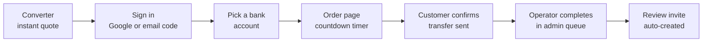

<div align="center">


# PLUS Converter

**A live marketplace for Bank of Georgia PLUS loyalty points.**

[](https://plusconverter.ge/en)
&nbsp;


</div>

Georgian bank customers accumulate PLUS loyalty points they often can't spend, and buyers
want them at a discount. That trade used to happen in Facebook groups: no pricing, no
trust, no record. **PLUS Converter turns it into a product** - a mobile-first web app where
a customer gets an instant quote, places a buy or sell order, and settles by bank transfer
against a countdown timer, while a single operator runs pricing, inventory, and the order
queue from a realtime admin panel.

It is a real business running in production, not a portfolio exercise. Every design
decision below was made under that constraint.

### At a glance

| | |
|---|---|
| **Live** | [plusconverter.ge](https://plusconverter.ge/en) (English; the bare domain serves Georgian) |
| **Users** | Customers buying/selling points · one operator running the desk |
| **Platform** | Mobile-first web, trilingual (Georgian default, English, Russian) |
| **Stack** | Next.js 16 App Router · Supabase (Postgres/Auth/Realtime/RLS) · TypeScript · Tailwind v4 · Vercel |
| **Size** | ~6.2k lines TypeScript · 15 SQL migrations · 3 message catalogs · 230+ commits |
| **Team** | Solo: product, design, engineering, and operations |

**Contents** · [How it works](#how-it-works) · [What it does](#what-it-does) ·
[Architecture](#architecture) · [Running locally](#running-locally) ·
[Deployment](#deployment) · [Engineering highlights](#engineering-highlights) ·
[Trade-offs](#trade-offs-deliberately-made)

---

## How it works

### The pricing model

Bank of Georgia fixes the face value of a point. The operator's spread rides on top of it:

```
        400 points  =  1 GEL          fixed face value, set by the bank
      x  multiplier                   the operator's buy or sell spread
      ------------------------------
      =  your quote
```

Two knobs, one for each direction, live in a single `settings` row the operator edits from
the admin panel. **The converter shows the customer only the 400-base face value - never
the multiplier**, so the desk's margin isn't public.

Internally, **points are always the canonical amount**. A buy order entered in GEL is
converted to points client-side, and the server derives the GEL leg back from the points.
One direction of truth means the two legs can never disagree.

### The order lifecycle



| Step | What the customer does | What the system does behind it |
|---|---|---|
| **1. Quote** | Types an amount, flips buy/sell | Validates against live min/max thresholds; the quote updates in place when the operator reprices |
| **2. Sign in** | Google, or a one-time code by email | Draft order is preserved across the redirect, so signing in never loses their input |
| **3. Choose account** | Picks which bank account to pay or be paid on | Account availability is live; the choice is re-validated server-side before the order exists, including the domain rule that sell orders can only settle to a Bank of Georgia account, since PLUS points don't transfer between banks |
| **4. Settle** | Transfers the money, taps "I paid" | Rate is snapshotted onto the order; a timer bounds how long the quote is honored |
| **5. Fulfilment** | Waits | Operator sees the order the moment it lands, plus an email alert; completing it moves the points |
| **6. Feedback** | Rates the trade once | A review row is minted by the database on completion, so only real transactions can be reviewed |

### Who does what

- **Customer** - quote, order, confirm payment, rate the trade. Sees their own order history
  and the public review feed.
- **Operator** - sets both multipliers, min/max limits and the timer; toggles either
  direction off entirely; manages which bank accounts are live; works the pending-order
  queue; moderates reviews.
- **Database** - the final referee. Pricing, limits and order state are re-checked in
  Postgres, so no client path can talk it into a bad order.

---

## What it does

**For customers**
- Instant quote with live buy/sell toggle, no rate hunting
- Google sign-in or passwordless email code
- Realtime order page with countdown, payment instructions, and one-tap payment confirmation
- Own order history, plus a public feed of completed trades and reviews
- Georgian / English / Russian, and light / dark themes

**For the operator**
- Pricing desk: both multipliers, per-direction minimums and caps, order timer
- Kill switch per direction when inventory or cash runs out
- Bank account inventory with `available` / `unavailable` / `sold out` states
- Live order queue - complete or cancel, with customer payment details in view
- Review moderation (hide/unhide) on a post-then-moderate feed
- Email alert on every new order, so the desk doesn't have to watch a dashboard

**Growth and reliability**
- Meta Pixel plus server-side Conversions API for ad attribution that survives a closed tab
- Public platform stats (orders, points, users) as social proof, served without exposing
  any order data
- In-app-browser detection: Facebook/Instagram/TikTok webviews block Google OAuth, so the
  app detects them and prompts the user to open in a real browser
- Out-of-hours receipt emails covering a known gap in the bank's own SMS confirmations

---

## Architecture

```
app/[locale]/          Locale-routed pages: converter, order/new, order/[id], admin, legal
app/auth/callback/     Non-localized OAuth code exchange
proxy.ts               next-intl routing + Supabase session refresh (Node runtime)
components/            Client components (Converter, AccountPicker, OrderView, admin/*)
lib/actions/           Server actions: orders, admin, auth, profile, reviews
lib/pricing.ts         Canonical conversion math, shared by client preview and server
lib/supabase/          Browser/server/proxy clients + hand-maintained DB types
lib/meta-*.ts          Meta Pixel (browser) and Conversions API (server)
i18n/ · messages/      Routing config and ICU message catalogs (ka, en, ru)
supabase/migrations/   Numbered schema: tables, RLS, triggers, RPCs, Realtime, seed
```

### Data model

| Table | Purpose | Who can write |
|---|---|---|
| `profiles` | Auto-created on signup; username, bank details, `is_admin` flag | Own row; admin via policy |
| `settings` | Singleton: multipliers, thresholds, toggles, order timer | Admin only |
| `bank_accounts` | Operator's accounts with availability states | Admin only |
| `orders` | Snapshotted rate + both legs; status machine | Insert guarded by trigger; customer transitions via RPC; admin via policy |
| `reviews` | Minted by trigger on completion; one rating per order | `submit_review` RPC only; moderation via policy |

Reads that need aggregates but not rows (homepage stats) go through purpose-built
`SECURITY DEFINER` RPCs rather than a broad `SELECT` grant, so names and account numbers
never leave the database.

---

## Running locally

**Prerequisites:** Node 20.9+, a free [Supabase](https://supabase.com) project.

```bash
npm install
cp .env.example .env.local     # fill in the two NEXT_PUBLIC_SUPABASE_* values
```

1. **Apply the schema.** Run `supabase/migrations/` in order (or `supabase db push`).
   `0001_init.sql` creates the tables, RLS policies, triggers and RPCs, enables Realtime,
   and seeds default settings; later migrations layer on the multiplier pricing model,
   reviews, thresholds, the order-insert guard, and the public stats RPC.

2. **Enable Google OAuth** in Supabase → Authentication → Providers, backed by a Google
   Cloud OAuth client using the redirect URL Supabase gives you.

3. **Start it and promote yourself.**

   ```bash
   npm run dev        # http://localhost:3000
   ```

   Sign in once, then in the Supabase SQL editor:

   ```sql
   update public.profiles set is_admin = true where email = 'you@example.com';
   ```

   The **Admin** link appears in the header.

Everything else is optional and no-ops when unset: `NEXT_PUBLIC_META_PIXEL_ID` and
`META_CAPI_ACCESS_TOKEN` for ad tracking, `RESEND_API_KEY` for order alert emails.

| Command | |
|---|---|
| `npm run dev` | Turbopack dev server |
| `npm run build` | Production build; doubles as the full typecheck |
| `npm run lint` | ESLint |

## Deployment

Vercel, Node 20.9+. Set the two `NEXT_PUBLIC_SUPABASE_*` variables, then register the
production domain in **both** Supabase Auth redirect URLs **and** the Google OAuth client -
missing either produces an auth failure that only reproduces in production.

---

## Engineering highlights

The parts worth reading if you're evaluating the code rather than the product.

<details open>
<summary><b>Pricing is server-authoritative, with defense in depth</b></summary>

The client-side converter is a preview and nothing more. `createOrder`
([`lib/actions/orders.ts`](lib/actions/orders.ts)) discards client-sent amounts and
recomputes the rate and both legs from the canonical `settings` row -
[`lib/pricing.ts`](lib/pricing.ts) is imported by both the preview and the server, so the
math cannot drift between them.

Then a Postgres `BEFORE INSERT` trigger
([`0008_order_insert_guard.sql`](supabase/migrations/0008_order_insert_guard.sql))
re-validates thresholds and recomputes the same fields **again**. A direct PostgREST call
that skips the server action still can't store a forged price, insert an order as already
`completed` (which would have minted a fake public review), or exceed the 4-concurrent-order
cap. The database, not the app tier, is the last word on money.
</details>

<details>
<summary><b>RLS-first security model</b></summary>

Every table has Row Level Security, and the browser only ever holds the publishable key -
which is what makes shipping it to the client safe. Customers can't self-complete orders,
because the transitions they're allowed to make (`mark_order_paid`, `submit_review`) are
narrow `SECURITY DEFINER` RPCs instead of broad `UPDATE` policies. The complete set of
writes a user can perform is enumerated in SQL and reviewable in one place.

Follow-up hardening in [`0015_rls_performance.sql`](supabase/migrations/0015_rls_performance.sql)
came from Supabase's own advisor: `auth.uid()` calls wrapped as `(select …)` so Postgres
evaluates them once per statement instead of once per row, overlapping permissive policies
split apart, a missing FK index added, and a mutable `search_path` pinned.
</details>

<details>
<summary><b>Realtime as the default, not a feature</b></summary>

Pricing, thresholds and direction toggles live in a singleton `settings` row the converter
subscribes to over Supabase Realtime. When the operator reprices, every open session
updates without a refresh - which matters when a customer is mid-decision and the desk's
inventory just changed. The admin order queue, bank-account availability, and the public
review feed ride the same channel.
</details>

<details>
<summary><b>Privacy designed into the schema</b></summary>

The public review feed is denormalized on purpose: no `user_id`, and a snapshotted display
name. Users who never set a username get a masked one derived from their email -
[`0011_masked_email_display_name.sql`](supabase/migrations/0011_masked_email_display_name.sql)
shows the first and last two characters of the local part with a **fixed-width** mask
between them, so the real length isn't leaked either, and the domain is never shown. The
alternative, a wall of identical "Anonymous" rows, was worse for trust and no better for
privacy.
</details>

<details>
<summary><b>Attribution that survives the user closing the tab</b></summary>

`CompleteRegistration` and `Purchase` are dual-fired: a browser pixel event, plus a
server-side Conversions API event from the code that actually owns that moment. This exists
because an order is completed manually by the operator, possibly hours later - the buyer's
tab is long gone, so a browser-only pixel would systematically under-report the conversions
that matter most.

Getting a dual-fire right is mostly in the details: the dedup key is per-entity
(`purchase_${orderId}`) and shared by both sides so Meta collapses the pair instead of
double-counting, and the registration event is gated on an actual first sign-in so a
returning user re-authenticating past Meta's dedup window isn't recounted as a new signup.
</details>

<details>
<summary><b>Current-generation Next.js, read from the source</b></summary>

App Router on Next 16: Server Components by default, mutations through server actions, and
[`proxy.ts`](proxy.ts) - Next 16's successor to `middleware.ts` - composing next-intl locale
routing and Supabase session refresh into a single Node-runtime response. Enough of this
surface changed in Next 16 that the published tutorials are actively wrong; the conventions
here were taken from the shipped docs in `node_modules`, and the traps are written down in
[`CLAUDE.md`](CLAUDE.md) so they only cost time once.

Operational details in the same spirit: Supabase clients are wrapped with an
[abort-signal timeout](lib/supabase/fetch-with-timeout.ts) so a stalled upstream fails in
10s instead of holding a serverless function open to the platform's 300s ceiling, and
side effects like alert emails run in `after()` so they can never fail an order.
</details>

<details>
<summary><b>Three real locales, not machine placeholders</b></summary>

`/` is Georgian, `/en` and `/ru` are English and Russian - real hand-written catalogs, not
machine placeholders. Every user-facing string is an ICU message with English as the key
source of truth, and navigation goes through locale-aware wrappers so links can't drop the
prefix. Locale detection is deliberately **off**: the URL is the only source of truth, or a
stale cookie can bounce a Georgian user to `/en` mid-flow.
</details>

## Trade-offs, deliberately made

- **Hand-maintained DB types** ([`lib/supabase/types.ts`](lib/supabase/types.ts)) rather
  than codegen. The schema is small, the types double as readable documentation, and they
  are kept in lockstep with the migrations. There is one non-obvious constraint baked in:
  the row types must be `type` aliases, not `interface`, or postgrest-js resolves every
  query to `never`.
- **Manual bank-transfer settlement** rather than a payment provider. This is how the
  market actually operates, it avoids per-transaction fees on thin margins, and it keeps
  the operator in the loop on every order - which is also the fraud control.
- **No secret-key server path.** Everything runs through RLS with the publishable key. It
  costs some convenience, and it buys a security story that lives entirely in the migration
  files instead of being spread across application code.
- **Single-operator by design.** No multi-tenancy, no role hierarchy beyond `is_admin`.
  Building for a second operator that doesn't exist yet would be the expensive mistake.

<div align="center">
<br>

Built by [guramnozadze](https://github.com/guramnozadze) · Source published for review, not licensed for reuse

</div>
